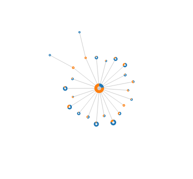

# d3cap

A [libpcap]-based network activity visualizer / playground for learning [d3] and [Rust].

[libpcap]: http://www.tcpdump.org/
[d3]: http://d3js.org/
[rust]: http://www.rust-lang.org/

Includes half-assed rust bindings for libpcap and a quarter-assed rust websocket server implementation.

To run, you need libpcap installed and a recent rust compiler (I try to track rust master), then:

    $ git clone https://github.com/jfager/d3cap.git
    $ cd d3cap
    $ make run

Open d3cap/client.html in a browser and hit the Connect button to attach to this running backend and you should start seeing network activity pop up, like so:

The size of each node indicates how much data has passed through the corresponding host, with blue and orange showing the proportion sent and received.  You can mouse over a node to see the corresponding address.
